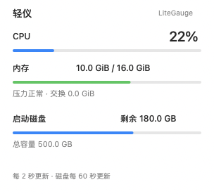
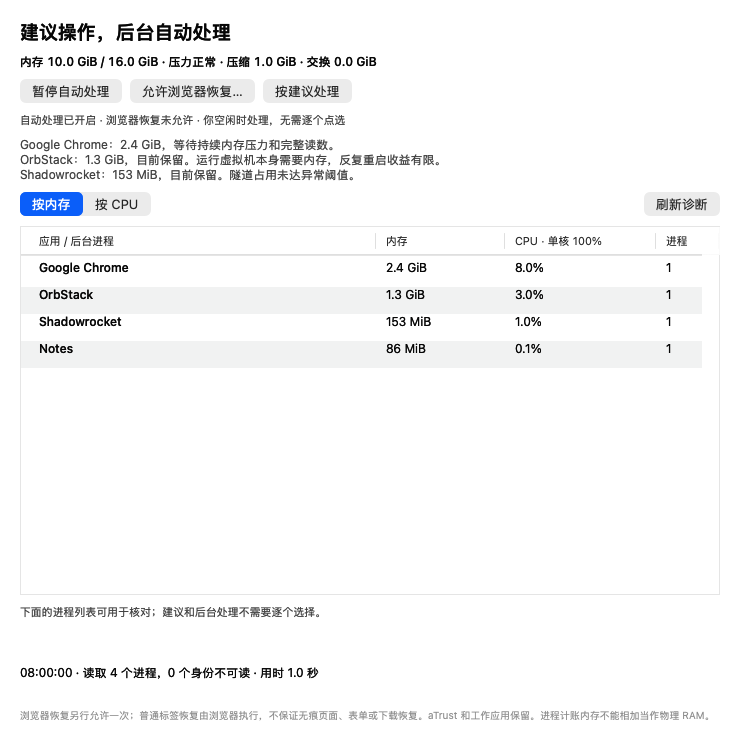

# LiteGauge

“Check for Updates…” queries this product's GitHub Release on demand and offers an upgrade. No metrics are uploaded and no background update polling is added. Automatic-care policy and results stay local.

[中文](README.md) | **English**

A native macOS system monitor in **56 points of menu-bar space**: CPU, memory, and startup-disk capacity at a glance.

[Website and guide](https://litegauge.tianli.cyou) · [Download](https://github.com/zengtianli/LiteGauge/releases/latest) · [Report an issue](https://github.com/zengtianli/LiteGauge/issues)




These are sample-value renders of the app's own AppKit interface. The [24-second demo](docs/media/demo.mp4) shows that native renderer and live sampling; it is not a recording of mouse interactions.

A stacked CPU label and percentage are followed by two vertical bars for memory and disk utilization. Click for exact values, memory pressure, swap usage, and free disk space.

- **Three focused readings.** CPU and memory update every 2 seconds; disk capacity every 60 seconds. Open the menu or press ⌘R to refresh immediately.
- **Native local sampling.** Swift + AppKit, no third-party runtime dependencies or shell-based polling. Sampling stays offline; only an explicit update check contacts the release channel. No account is required.
- **Less background work.** Periodic collection pauses during system sleep, display sleep, and screen lock. CPU sampling resets on resume, and the menu bar updates only when visible integer values change.
- **Advice and automatic care.** Get concrete recommendations without selecting apps one at a time. Basic care handles Shadowrocket / OrbStack; since 0.4.0, a separate opt-in adds idle browser recovery for Dia / Chrome. Results show app-accounting and system-used memory changes, or why the main footprint remains untreated.
- **Ready for scripts and agents.** The same executable provides `status --json`, `watch` for readings at the app's cadence, and `app status` for the menu-bar instance; GUI and CLI share their collection code and colour thresholds.

## Download and install

Requires **Apple Silicon (M1 or newer) and macOS 14 or later**. Intel builds are not currently provided. The application interface is in Chinese.

1. Download the matching `LiteGauge-<version>-arm64.dmg` from [Releases](https://github.com/zengtianli/LiteGauge/releases/latest).
2. Open the DMG and drag `LiteGauge.app` into `Applications`.
3. Launch LiteGauge from Applications and check the top menu bar. There is no persistent main window; resource diagnosis opens on demand.

A ZIP is also available: extract it and move the app into Applications. Official release artifacts use Developer ID signing, hardened runtime, and Apple notarization. Each Release includes notarization information in `release.json` and hashes in `SHA256SUMS`. To update, quit LiteGauge with ⌘Q from its menu, then replace the old app.

No login item is added automatically, and other monitoring apps are not reconfigured. To start at login, add LiteGauge in macOS System Settings → General → Login Items.

## Use

| Action | Result |
|---|---|
| Click the menu-bar CPU / bars | Open CPU, memory, and disk details |
| ⌘R while the menu is open | Refresh immediately |
| ⌘Q while the menu is open | Quit LiteGauge |
| Resource advice and automatic care | Concrete recommendations, automatic-care status and optional process details |
| Open Activity Monitor | Inspect individual processes |

The native menu supports arrow keys and Return. No global shortcuts are registered. The first CPU value requires approximately one second of sampling.

### Resource advice and automatic care (since 0.3.0)



Each diagnosis samples for approximately one second and groups executables under their outer app bundle. Memory is `phys_footprint`, including compressed/swapped accounting, so app totals must not be added as physical RAM. Interval CPU uses 100% per core, unlike the menu bar's normalized whole-system 0–100%. Unreadable, exited and newly started processes are marked as unavailable or partial coverage.

Automatic care defaults to off for public installs. After one opt-in, memory pressure must stay elevated for 90 seconds before a scan, with at least two minutes between scans and no additional process scans at normal pressure. Shadowrocket must exceed 512 MiB or OrbStack 2 GiB on two observations. The user must be idle for two minutes, the target must be in the background, and its CPU must be below 10%. Incomplete readings, identity changes and busy apps defer action.

Each check handles at most one allowed app. Basic services have a one-hour success cooldown; failure pauses retries for six hours. OrbStack restarts briefly interrupt containers/VMs; Shadowrocket reconnects briefly interrupt networking. Settings, images and data remain intact. aTrust, editors and indexers are retained, and normal VM or stable index memory gets a keep recommendation. A single “Run recommendations” control provides an immediate check without per-app selection.

Since 0.4.1, clicking “Run recommendations” immediately handles the initial allowed high-memory plan in sequence, even at normal memory pressure, without waiting for idle input or a second observation. Each item is rechecked; identity, completeness, CPU, foreground and cooldown guards still apply. Results appear at the top with actual action counts, app changes and system changes. Zero actions have an explicit reason; the button is disabled when nothing is executable. Automatic background checks still handle one app and wait for sustained pressure and idle input.

Since 0.4.0, a separate one-time browser opt-in adds Dia (above 3 GiB) and Chrome (above 2 GiB) to the same sustained-pressure, idle, background and low-CPU policy. Upgrading an existing basic policy does not grant browser permission. LiteGauge backs up readable normal session files before a graceful quit, then requests normal-tab restoration with `--restore-last-session`. Pages reload; private tabs, unsent forms, downloads and page tasks may be lost or interrupted. Missing readable session files defer the quit. Browsers have a six-hour cooldown after either success or failure. Browser care can be paused separately.

If restarting reduces app-accounting memory by less than 10%, automatic retries pause for 24 hours; retained pages may simply need that memory.

Policy and the last 20 results stay in the owner-only `~/Library/Application Support/LiteGauge/` folder. Nothing is uploaded. Only two normal-session backups per browser are retained; cookies, history databases and passwords are not copied. App-accounting and system-used memory changes are reported separately, alongside reasons for deferred action. Other tasks can affect system changes. Tab restoration is requested, but its tab count is not verified. Quitting waits for ongoing restoration. Processes are never force-killed and system caches are never purged.

## Command line

The CLI and the menu-bar app are the same executable and read from the same collection layer (`Sources/Metrics.swift`). The pressure levels and the 90% disk threshold that colour the panel live in that layer too, so the levels the CLI reports match the panel colours. The installed app includes the CLI; no separate runtime is required:

```sh
/Applications/LiteGauge.app/Contents/MacOS/LiteGauge status --json
```

Optionally add a shorter command (`bash scripts/install.sh` adds it on first install; inspect any existing entry before replacing it):

```sh
mkdir -p "$HOME/.local/bin"
ln -s /Applications/LiteGauge.app/Contents/MacOS/LiteGauge "$HOME/.local/bin/litegauge"
```

After adding `~/.local/bin` to PATH:

```sh
litegauge status                   # one reading: CPU / memory / disk (about 1 s of sampling)
litegauge status --json            # the same as one JSON object
litegauge diagnose --sort memory --limit 10 --json # rankings, pressure, coverage and advice
litegauge diagnose --sort cpu      # interval CPU ranking (100% = one core)
litegauge care plan --json         # concrete recommendations and reasons to defer or retain
litegauge care enable --yes        # opt in once; care disable pauses automatic care
litegauge care browsers --yes      # separately allow browser recovery; --disable pauses it
litegauge care status --json       # policy, last check and action results
litegauge care run --dry-run --json # preview the combined operation; --yes performs it
litegauge process restart --pid 123 --token 123:1790000000:0 --dry-run --json # read token from diagnosis; --yes performs the action
litegauge watch --count 5 --json   # stream at the app's cadence (every 2 s by default), one JSON object per line (NDJSON)
litegauge watch --interval 10      # one text line every 10 s until Ctrl-C
litegauge app status --json        # whether the menu-bar instance runs: pid, bundle path, version
litegauge app quit --dry-run       # show which instance would quit; use --yes to quit it (same as ⌘Q)
litegauge app quit --yes --pid 123 # quit only the menu-bar instance with pid 123
litegauge --version --json
litegauge --help                   # also -h or help; --help / -h after any command or flag only prints help and runs nothing
```

`watch`, `app`, `--version --json`, and the level, percentage, and error-code fields below are available from 0.1.2; 0.1.1 only has `status [--json]`, `--version`, and `--help`. These also take effect from 0.1.2: `-h`, `help`, and `--help` after a command print help (0.1.1 exits 2), and `litegauge` with no arguments only prints usage (0.1.1 goes down the menu-bar app launch path).

Each record of `status --json` and `watch --json`:

| Field | Meaning |
|---|---|
| `ok` | `true` when `errors` is empty |
| `sampledAt` | Sample time, ISO 8601 |
| `cpuPercent` | Usage normalized across the whole processor, 0–100%; `null` before a baseline exists |
| `memory.totalBytes` / `usedBytes` / `compressedBytes` / `swapUsedBytes` | Integer bytes; used memory excludes reclaimable cache; swap is `null` if unreadable |
| `memory.percent` | Memory used, the menu-bar memory bar |
| `memory.pressureLevel` | System memory pressure: `normal`, `elevated`, `critical`, `unknown`; `memory.pressure` is the Chinese label |
| `memory.level` | Panel colour: `normal` green, `warning` orange, `critical` red |
| `disk.totalBytes` / `availableBytes` | Capacity and free space of the APFS container holding the startup Data volume |
| `disk.usedPercent` | Disk used, the menu-bar disk bar |
| `disk.level` / `disk.warnAbovePercent` | `warning` above `warnAbovePercent` (90), when the panel bar turns orange |
| `disk.mountPoint` / `disk.volume` | The mount point read, `/System/Volumes/Data`; Chinese display name |
| `disk.sampledAt` | When the disk was read; like the app, `watch` re-reads it every 60 seconds |
| `errors` / `errorCodes` | The error text the panel shows; stable codes `cpu_unavailable`, `memory_unavailable`, `disk_unavailable` |

Missing readings are written as `null`; every key is always present. `app status --json` reports `running`, `instances[]` (`pid`, `bundlePath`, `version`, `build`, `launchedAt`, `sameBundleAsCLI`), and the `cli` bundle the command itself runs from; `app quit --json` reports `targets`, `stillRunning`, `dryRun`, and `pid`. Both count only instances with a menu-bar item (`.accessory` processes that have finished launching); offscreen acceptance runs such as `--ui-self-test` and `--snapshot` are neither listed nor quit.

Exit codes: `0` success; `1` collection failure (`ok: false`) or `app quit` could not finish within 5 seconds; `2` invalid arguments (stderr only). `--help` and `--version` return immediately. `litegauge` with no arguments prints usage and exits 2; it never starts the menu-bar app. Start the app from Applications or with `open -g -j /Applications/LiteGauge.app`.

| Menu-bar app | Command line |
|---|---|
| Menu-bar CPU percentage, memory and disk bars, accessibility value | First line of `status`; `cpuPercent`, `memory.percent`, `disk.usedPercent` |
| Detail panel: memory use and pressure colour, swap, free disk and the 90% warning | Lines 2–3 of `status`; `memory.*`, `disk.*` and their `level` |
| Updates every 2 seconds, disk every 60 seconds | `watch` |
| ⌘R refresh | Every `status` is a fresh sample including disk (it does not refresh the running menu-bar item) |
| "Unavailable" on read failure | `errors` / `errorCodes`, exit code 1 |
| ⌘Q quit | `app quit --yes` (check the target with `--dry-run` first) |
| Whether the menu-bar item is there | `app status` |
| Concrete advice / automatic-care status | `care plan` / `care status` |
| Opt in once / pause automatic care | `care enable --yes` / `care disable` |
| Combined care for allowed abnormal services | `care run --dry-run` to preview, `care run --yes` to execute |

GUI-only: clicking to open the menu, arrow-key menu navigation, "Open Activity Monitor" (use `ps` or `top` from the command line), and the automatic pause during sleep and screen lock (internal app behaviour with no user action). Development and acceptance flags `--ui-self-test`, `--snapshot`, `--benchmark`, and `--background` are listed in `--help`.

<!-- lightweight:start -->
## Resource use

| Download | Idle memory | Idle CPU | First CPU reading after app setup (median of 5) |
|---|---|---|---|
| **1.7 MB** (installed 1.9 MB) | **15.7 MB** | **0%** | **1.2 s** |

Native AppKit; no third-party runtime or network requests; shared 2-second CPU/memory sampling, 60-second disk-capacity cache, redraw only on visible-value changes.

<sub>v0.1.2 (3) · Mac16,12 / Apple M4 / macOS 27.2 · Notarized release; menu closed; CPU/memory every 2 seconds and disk every 60 seconds. Measured on the resident instance after about 13 hours of running (not freshly launched); 60-second CPU window, footprint read in the same pass. · measured 2026-10-01. Measured on the listed device; re-measured for each version. Memory uses phys_footprint; CPU is CPU time ÷ wall time over a 60-second sampling window; sizes in decimal MB. Raw data: [perf/lightweight.json](perf/lightweight.json).</sub>
<!-- lightweight:end -->

These are measurements on the listed device and refresh settings, not a guarantee for every Mac. Time to the first CPU value includes its sampling interval and is not a full cold-start measurement.

## FAQ

**Why does memory usage differ from another tool?** Memory is displayed in GiB. Used memory excludes reclaimable file cache and purgeable pages. Pressure comes from the system; utilization alone does not indicate a shortage.

**Why does free disk space differ from Finder?** LiteGauge reads the startup Data volume's APFS container capacity and currently available blocks. It does not add capacities across shared volumes or include purgeable space. Disk values use decimal GB. The bar shows used capacity; the detail panel shows available space.

**Does it monitor network, temperature, fans, or individual processes?** The menu bar shows CPU, memory, and startup-disk capacity. Resource advice includes process details and opt-in automatic care for the two supported background services. Network speed, sensors, fan control, disk throughput, and history charts are not included.

**Can I keep Stats installed too?** Yes. They have different names and bundle identifiers. Running both adds their resource use together; keep both installed and run one at a time if you prefer.

**Where is the menu-bar item?** Confirm the app is running, then check whether a menu-bar manager or the display notch is hiding it. Try quitting other menu-bar apps to make room.

**What if macOS refuses to open it?** Confirm you downloaded from this repository's Release and compare the file with `SHA256SUMS`. Official artifacts are signed and notarized. If it still fails, report the full message, macOS version, chip, and app version in an Issue. Do not disable Gatekeeper.

**How do I uninstall it?** Quit LiteGauge from its menu and move the app to Trash. Remove the optional CLI symlink and login item if you added them. Delete `~/Library/Application Support/LiteGauge/` to remove local automatic-care policy and results too.

## Build from source

Requires an Apple Silicon Mac and Xcode Command Line Tools / Xcode with Swift 5.9 or newer. Run `xcode-select --install` if the tools are missing.

```sh
git clone https://github.com/zengtianli/LiteGauge.git
cd LiteGauge
bash build.sh
open build/LiteGauge.app
```

The build script runs tests first, then creates `build/LiteGauge.app` with a local ad-hoc signature. A source build is not a notarized release. It uses standard `xcrun` tooling and requires no other developer checkout. Set `DEVELOPER_DIR` to select a specific Xcode installation.

```sh
bash build.sh --test-only
bash scripts/install.sh  # Install to /Applications, plus ~/.local/bin/litegauge; the old app goes to the Trash
bash scripts/install.sh --restart  # If the installed copy is running: quit, replace, relaunch in the background
```

Tests cover CPU deltas and wraparound, memory accounting and underflow, disk caching and refresh, overlapping sleep/lock state, pressure levels and colour thresholds, JSON fields, command-line parsing, `watch` streaming, and live system reads. `Sources/Metrics.swift` provides shared collection (including levels and thresholds), `Sources/App.swift` implements the interface, `Sources/CLI.swift` parses commands and formats output, and `Sources/main.swift` handles entry points.

Release maintainers can use `scripts/package-release.sh` to build signed, notarized ZIP and DMG artifacts. Set `CODE_SIGN_IDENTITY`, then use `NOTARY_PROFILE`, or `ASC_KEY_ID`, `ASC_ISSUER_ID`, and `NOTARY_KEY_FILE`. Outputs include `build/release/release.json` and `SHA256SUMS`. Never commit credentials.

## License and feedback

[MIT License](LICENSE). LiteGauge is an independent minimal tool using Apple system APIs, not a fork of Stats. The icon was generated with OpenAI image generation; provenance is recorded in `icon/provenance.json`.

[Issues](https://github.com/zengtianli/LiteGauge/issues) and contributions are welcome. Include your app version, system, chip, reproduction steps, and expected behavior. Check screenshots and CLI output for personal information before posting.
